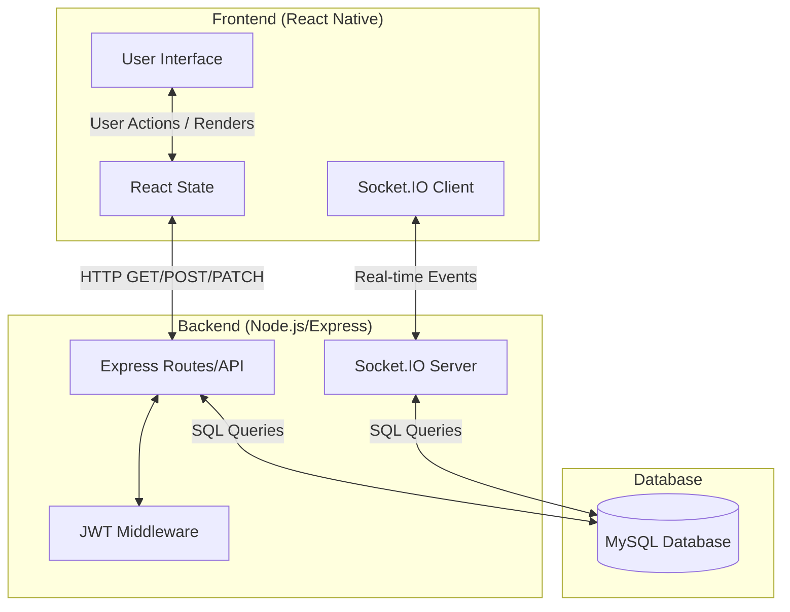
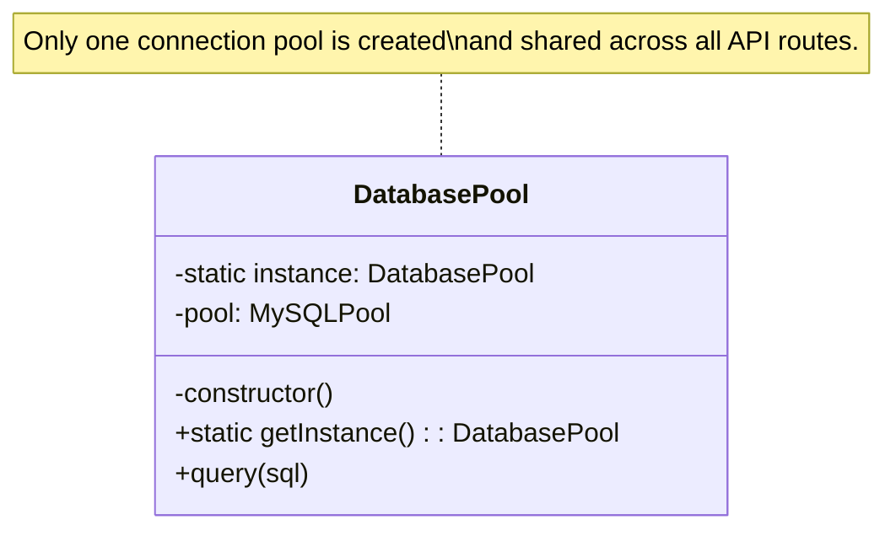
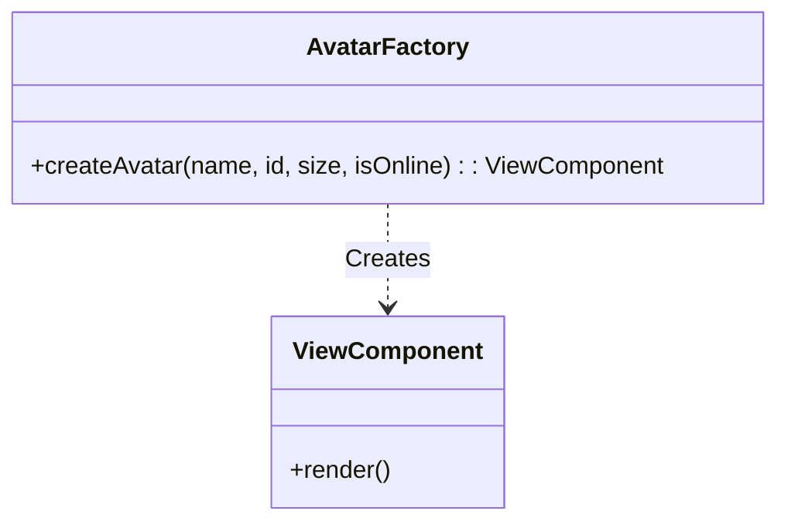
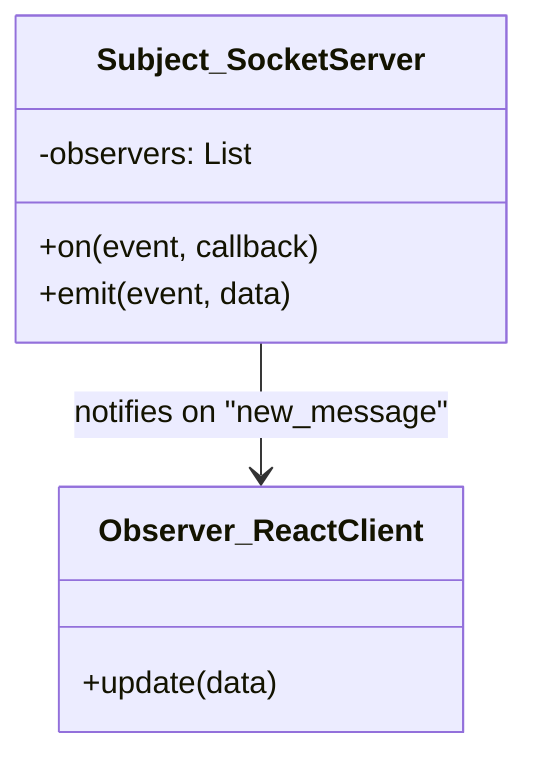

# 5. System Design and Design Patterns

## 5.1 System Architecture

### Overall System Structure
The system follows a **Client-Server Architecture**. 
- **Client (Frontend)**: A mobile application built with **React Native** (`habit-tracker-mobile`). It handles the User Interface (UI), local state management, and user interactions.
- **Server (Backend)**: A RESTful API server built with **Node.js and Express.js** (`server`). It handles business logic, authentication, and database operations.
- **Real-time Communication**: Uses **Socket.IO** for real-time features like instant messaging and online user tracking.
- **Database**: A relational **MySQL** database used to persist user data, habits, friendships, and messages.

### UML Diagram Explanations
Below is the general architecture diagram showing how the components interact:



---

## 5.2 Design Patterns Used

### 1. Singleton Pattern

**Why used:** 
The Singleton pattern ensures that a class or module has only one instance and provides a global point of access to it. This is highly important for resource-heavy objects like Database connections or Socket instances to prevent memory leaks and ensure synchronized state.

**Where used:**
- **Backend:** The MySQL Database Connection Pool (`db`) in `server.js`.
- **Frontend:** The `AsyncStorage` instance for local token storage, and the single `socket` connection instance maintained in the React state.

**UML Diagram:**


**Code Snippet:**
```javascript
// server/server.js
// Singleton Database Pool Creation
const db = await mysql.createPool({
  host: process.env.DB_HOST,
  user: process.env.DB_USER,
  password: process.env.DB_PASSWORD,
  database: process.env.DB_NAME,
  connectionLimit: 10,
});
// This 'db' instance is globally used by all routes, e.g.:
// await db.query("SELECT * FROM users ...");
```

**Screenshots:**
*[Screenshot showing the Database Connection setup in server.js]*

---

### 2. Factory Pattern

**Why used:**
The Factory pattern abstracts the creation of objects. Instead of calling a constructor directly, a factory function creates and returns the object. In React, functional components act as factories that take properties (props) and return UI elements.

**Where used:**
- **Frontend:** UI Components like the `Avatar` function in `App.js`. It takes raw data (`name`, `id`) and dynamically generates the styled avatar UI object.
- **Backend:** The `formatHabit(h)` function in `server.js` which takes raw database row data and factories a clean, formatted habit object for the client.

**UML Diagram:**


**Code Snippet:**
```javascript
// habit-tracker-mobile/App.js
// Factory Component for creating User Avatars dynamically
function Avatar({ name, id, size = 40, isOnline = false }) {
  const hue = ((id || 0) * 67) % 360;
  const bg = `hsl(${hue},55%,88%)`;
  const color = `hsl(${hue},55%,35%)`;
  
  return (
    <View style={{ width: size, height: size }}>
      <View style={{ backgroundColor: bg, /* ... */ }}>
        <Text style={{ color }}>{name.charAt(0).toUpperCase()}</Text>
      </View>
      {isOnline && <View style={/* Online Badge Styles */} />}
    </View>
  );
}
```

**Screenshots:**
*[Screenshot showing the rendered UI of various colored Avatars in the Community/Chat tab]*

---

### 3. Observer Pattern

**Why used:**
The Observer pattern is used to define a one-to-many dependency so that when one object changes state, all its dependents are notified and updated automatically. It's the core of event-driven architectures.

**Where used:**
- **Socket.IO:** Used heavily in both `server.js` and `App.js` for real-time messaging. The client *subscribes/observes* events (like `new_message`), and the server *publishes/emits* them.
- **React State:** `useEffect` and `useState` act as observers watching for state changes to trigger UI re-renders.

**UML Diagram:**


**Code Snippet:**
```javascript
// 1. Subject (Publisher) - server/server.js
io.on("connection", (socket) => {
  socket.on("send_message", async ({ receiverId, text }) => {
    const msg = { /* ... */ };
    // Emitting (Notifying) the specific observer/client
    const receiverSocket = onlineUsers.get(parseInt(receiverId));
    if (receiverSocket) io.to(receiverSocket).emit("new_message", msg);
  });
});

// 2. Observer (Subscriber) - habit-tracker-mobile/App.js
function connectSocket(token) {
  const s = io(API_BASE, { auth: { token } });
  
  // Listening/Observing for new messages
  s.on("new_message", msg => {
    setMessages(prev => prev.find(m => m.id === msg.id) ? prev : [...prev, msg]);
  });
}
```

**Screenshots:**
*[Screenshot showing the real-time chat interface updating when a new message arrives]*

---

### 4. MVC Pattern (Model-View-Controller)

**Why used:**
MVC separates the application into three interconnected components. This separates internal representations of information from the ways information is presented to and accepted from the user, making the codebase scalable and modular.

**Where used:**
The entire project architecture represents a decoupled MVC pattern:
- **Model:** The MySQL Database and the SQL queries defining the data structure (Users, Habits, Messages).
- **View:** The React Native components in `App.js` that render the UI and collect user inputs.
- **Controller:** The Express.js route handlers in `server.js` that receive HTTP requests from the View, process business logic, update the Model, and return responses.

**UML Diagram:**
```mermaid
graph LR
    View[View\n(React Native App.js)] -->|1. User Action / API Request| Controller[Controller\n(Express server.js)]
    Controller -->|2. Update/Query Data| Model[(Model\nMySQL Database)]
    Model -->|3. Return Data| Controller
    Controller -->|4. JSON Response| View
    View -->|5. Update UI| User((User))
```

**Code Snippet:**
```javascript
// --- MODEL (Implicit via Database schema and queries) ---
// Table: users (id, name, email, password, savings)

// --- CONTROLLER (server/server.js) ---
// Handles the logic of adding savings when a user resists a habit
app.patch("/api/habits/:id/action", authMiddleware, async (req, res) => {
  // ... logic checking action type ...
  const savedAmount = type === 'resisted' ? Number(habit.reward || 0) : 0;
  
  if (savedAmount > 0) {
    // Controller updating the Model
    await db.query("UPDATE users SET savings = savings + ? WHERE id = ?", [savedAmount, req.user.id]);
  }
  res.json({ ok: true, savedAmount });
});

// --- VIEW (habit-tracker-mobile/App.js) ---
// Displays the data and sends actions to the controller
async function handleHabitAction(habitId, type) {
  // Sending action to Controller
  const res = await apiFetch(`/habits/${habitId}/action`, { method: "PATCH", body: { type } });
  
  // Updating View state based on Controller response
  if (type === "resisted" && res.savedAmount > 0) {
    setUser(u => ({ ...u, savings: u.savings + res.savedAmount }));
  }
}
```

**Screenshots:**
*[Screenshot showing the Habit Action Buttons (View) and the Savings Card updating]*
